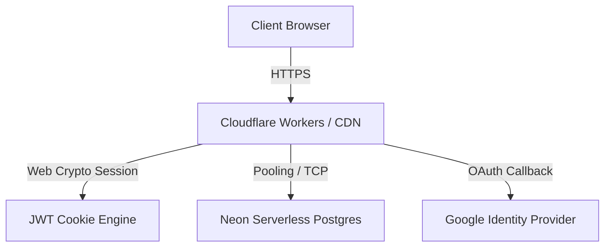

# OrbitOS — Production Deployment Playbook (Cloudflare Workers & Neon)

This guide outlines the production-grade deployment architecture, secrets management, and CI/CD automation for **OrbitOS** (TanStack Start + Drizzle ORM + Neon Postgres + Google SSO) targetting **Cloudflare Workers**.

---

## 1. System Architecture Overview



- **Runtime Environment**: Cloudflare Workers (V8 Edge Runtime) with `nodejs_compat` compatibility.
- **Database Layer**: Neon Serverless Postgres, using the `@neondatabase/serverless` WebSockets-based driver for edge compatibility.
- **Authentication**: Native Google SSO (JWT session tokens stored in secure, `HttpOnly`, `SameSite=Lax` cookies).

---

## 2. Environment Variables & Secrets Management

Review and configure the following variables. Do **not** commit values to source control.

| Variable Name | Context | Deployment Value | Description |
| :--- | :--- | :--- | :--- |
| `DATABASE_URL` | Server | Secret | Connection string from Neon. Must use the connection-pooled endpoint. |
| `VITE_GOOGLE_CLIENT_ID` | Client & Server | Public | Google OAuth 2.0 Web Client ID. |
| `JWT_SECRET` | Server | Secret | A strong cryptographically secure secret (minimum 32 bytes) for signing cookies. |

---

## 3. Database Sync & Operations

Edge functions require efficient database connection lifecycle management.

### Schema Sync
Before triggering a production deployment, ensure the Neon schema is synchronized. Run this command locally:
```bash
npx drizzle-kit push
```

> [!IMPORTANT]
> **Edge Connection Pooling**: Ensure you are using the pooled connection string (typically containing `-pooler` in the host name) in the production environment. Since Cloudflare Workers scale horizontally on every incoming request, they can rapidly exhaust Postgres connection slots without a pooler.

---

## 4. Production CI/CD Setup (GitHub Actions)

We manage production deployments via GitHub Actions. When code is pushed or merged into `main`, the build compiles assets and deploys them to Cloudflare.

The workflow configuration is defined at [.github/workflows/deploy.yml](file:///.github/workflows/deploy.yml).

### Step-by-Step Repository Setup
1. In your GitHub repository, navigate to **Settings > Secrets and variables > Actions**.
2. Add the following **Repository Secrets**:
   - `CLOUDFLARE_API_TOKEN`: Your Cloudflare API Token (create one using the *Edit Cloudflare Workers* template).
   - `CLOUDFLARE_ACCOUNT_ID`: Your Cloudflare Account ID.
   - `DATABASE_URL`: Your production Neon connection string.
   - `VITE_GOOGLE_CLIENT_ID`: Your production Google Client ID.
   - `JWT_SECRET`: A high-entropy session signing key.

---

## 5. Local Deployments (Manual Bypass)

If you need to perform hot-fixes or manual deployments from your local machine, ensure your `.env` contains the required keys and run:
```bash
npm run deploy
```
This script automates `npm run build` and invokes `wrangler deploy` to publish the worker.

---

## 6. Pre-Flight Checklist

Before final sign-off, verify:
- [ ] **Google OAuth Redirects**: Make sure your production domain is added to **Authorized JavaScript origins** in your Google Cloud Console.
- [ ] **HTTPS Enforced**: Cloudflare SSL is enabled (Full or Strict). HTTP-Only session cookies will fail to send on unencrypted HTTP protocol under standard `Secure` constraints.
- [ ] **JWT Key Rotation**: Set a reminder to periodically rotate your `JWT_SECRET` in production secrets.
